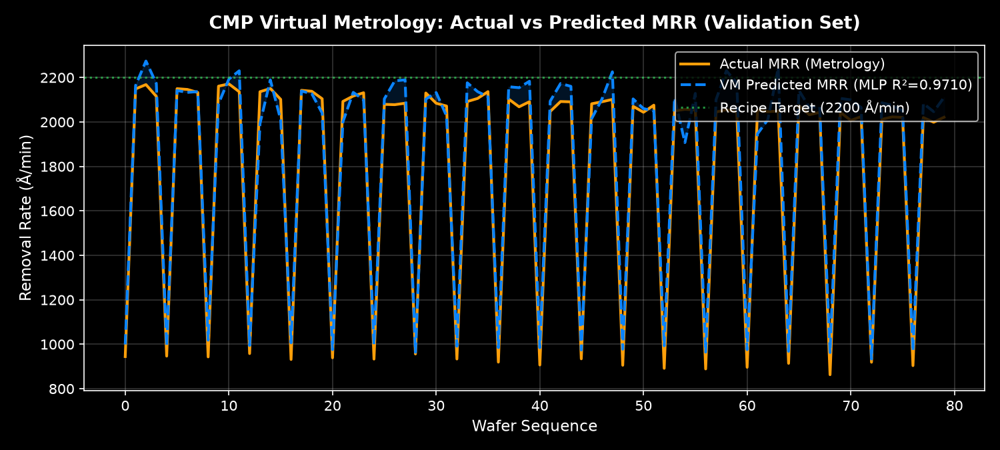
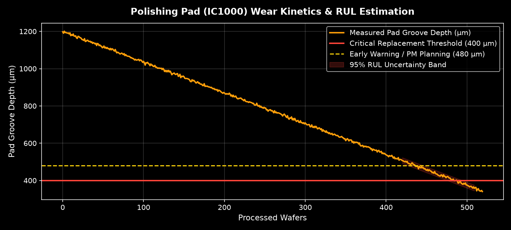

# 반도체 CMP 가상계측 및 알람 이원화 시뮬레이터
### Semiconductor Front-End CMP Virtual Metrology & Alarm Bifurcation Simulator

삼성전자 메모리(DRAM / V-NAND) 전공정 CMP(STI / W-Plug / Cu) 환경을 모사한 **가상계측(Virtual Metrology)** 및 **가역/비가역 알람 이원화(Alarm Bifurcation)** 시뮬레이터입니다.

- **🌐 라이브 시뮬레이터**: [https://jiu7021.github.io/CMP/](https://jiu7021.github.io/CMP/)
- **📑 엔지니어링 리포트**: [https://jiu7021.github.io/CMP/project.html](https://jiu7021.github.io/CMP/project.html)

---

## 1. 프로젝트 배경 및 문제 정의

CMP(Chemical Mechanical Planarization)는 회전하는 연마 패드와 화학 슬러리를 이용해 나노미터 단위로 웨이퍼 표면을 평탄화하는 반도체 전공정 핵심 기술입니다.
공정의 핵심 품질 지표는 **MRR(Material Removal Rate, 단위 시간당 제거율, Å/min)**입니다.

현장에서는 두 가지 치명적 병목이 발생합니다:
1. **전수 물리 계측의 불가능성**: 매 웨이퍼마다 박막 두께 측정기로 실측하면 팹 라인 정체가 발생하므로, 설비 센서 시계열로 MRR을 예측하는 **가상계측(VM)**이 필수적입니다.
2. **무분별한 알람과 불필요한 라인 정지**: 기존 FDC의 단순 임계치 방식은 가역적인 유량·압력 편차에도 일괄 경보를 발생시켜 극심한 오퍼레이터 피로와 라인 셧다운 손실을 유발합니다.

---

## 2. 핵심 설계: 알람 이원화 (Alarm Bifurcation)

이상(Anomaly)의 물리적 성격을 **"가역적(파라미터 보정 가능)"**과 **"비가역적(소모품 마모)"**으로 엄격히 분기합니다.

| 구분 | 가역적 이상 (A. 자동 보정 경로) | 비가역적 이상 (B. 사람 개입 경로) |
|---|---|---|
| **대상** | 슬러리 유량 편차, 다운포스 압력 드리프트, RPM 오프셋 | 폴리싱 패드 수명 한계(홈 소진), 컨디셔너 마모, 리테이닝 링 파손 |
| **물리적 특성** | 레시피 밸브/모터 제어로 즉시 복구 가능한 가역적 편차 | 물리적 재료 손실로, 파라미터를 조정해도 복구 불가능한 단조 열화 |
| **시스템 제어** | **알람 미발생 · 라인 무중단** (Run-to-Run APC 레시피 자동 보정) | **긴급 알람 발생 · 해당 챔버만 즉시 단독 정지** (타 챔버 정상 가동) |
| **화면 표기** | '자동 보정 이력'에 보정량(ΔP, ΔFlow) 기록 | 긴급 알람 팝업, 원인 소모품, RUL, **[재가동 승인]** 버튼 제시 |

### 💡 전공정 멀티챔버 단독 정지 & 재가동 메커니즘
- 전공정 CMP 설비(3개 챔버: Ch.A STI, Ch.B W-Plug, Ch.C Cu CMP)에서 **Ch.A의 패드가 수명 한계에 도달하면 Ch.A만 즉시 정지(0 RPM, 압력 소멸)**됩니다.
- **Ch.B와 Ch.C는 정상적으로 웨이퍼를 가공**하며, 실제 팹과 동일하게 조업 시간은 계속 흐릅니다.
- 작업자가 상단의 **`[소모품(패드) 교체 완료 · 재가동]`** 버튼을 누르면 패드가 신품(1200μm)으로 교체되고 Ch.A가 즉각 재가동됩니다.

---

## 3. 가상계측(Virtual Metrology) 모델 벤치마크

프레스턴 식($MRR = k_p \cdot P \cdot V$) 및 아레니우스 화학 반응식을 반영한 물리 파생변수를 주입하고, **시간 순서 70:30 분할(Data Leakage Zero)** 검증셋(Val 405매)에서 모델을 평가했습니다.

| 모델 아키텍처 | 검증 RMSE (Å/min) | 검증 MAE (Å/min) | 검증 $R^2$ 결정계수 | 판정 |
|---|---|---|---|---|
| **Baseline Ridge (L2 규제 선형)** | 96.49 | 91.52 | 0.9607 | 프레스턴 1차 근사는 우수하나 비선형 마모 한계 |
| **Baseline Random Forest (100 Trees)** | 129.10 | 111.80 | 0.9297 | 시간축 외삽(Extrapolation) 일반화 저하 |
| **Advanced MLP (64-32 ReLU) ★** | **82.94** | **67.01** | **0.9710** | **다변량 결합 관계 최고 정밀도 달성** |



---

## 4. 소모품 잔여수명(RUL) 추정

폴리싱 패드 잔여 홈 깊이(초기 1200μm, 임계 400μm)의 마모 궤적을 실시간 모델링하여, 교체 시점까지 남은 웨이퍼 매수와 **95% 신뢰구간([CI_low, CI_high])**을 산출합니다.



---

## 5. 프로젝트 구조

```
├── README.md               # 메인 프로젝트 문서
├── requirements.txt        # 의존성 패키지 목록
├── app_streamlit.py        # 로컬 브라우저 실행용 Streamlit 대시보드
├── src/
│   ├── phm_data.py         # PHM 2016 벤치마크 로더 및 물리 기반 합성 폴백 생성기
│   ├── virtual_metrology.py# 가상계측 모델 (Ridge, RF, MLP) 학습 및 평가
│   ├── alarm_engine.py     # 결정론적 가역/비가역 알람 이원화 엔진
│   ├── rul_estimator.py    # 소모품(패드/컨디셔너) RUL 및 95% CI 추정기
│   └── scenario_builder.py # 5일간 3개 챔버 양산 시나리오 빌더 및 번들러
├── scripts/
│   ├── 01_prepare_data.py  # 데이터셋 준비 (시간 순서 70:30 분할)
│   ├── 02_train_models.py  # 가상계측 모델 학습 및 벤치마크
│   ├── 03_run_scenarios.py # 알람 이원화 및 RUL 시뮬레이션
│   ├── 04_export_web.py    # docs/data.js 번들링
│   └── 05_figures.py       # 시각화 그래프 생성
└── docs/                   # GitHub Pages 정적 웹 시뮬레이터 (https://jiu7021.github.io/CMP/)
    ├── index.html          # SnowUI CMP 시뮬레이터
    ├── project.html        # 엔지니어링 기술 상세 보고서
    ├── app.js              # 실시간 멀티챔버 시뮬레이터 런타임
    ├── data.js             # 시나리오 및 검증 데이터셋
    ├── snowui-shell.css    # SnowUI 디자인 토큰 및 레이아웃
    ├── snowui-shell.js     # 내비게이션 스크롤스파이
    └── style.css           # CMP 설비 및 SVG 차트 스타일
```

---

## 6. 재현 및 실행 방법

### 1) 환경 설정
```bash
python3 -m venv .venv
source .venv/bin/activate
pip install -r requirements.txt
```

### 2) 파이프라인 단계별 실행
```bash
python scripts/01_prepare_data.py   # 데이터 준비
python scripts/02_train_models.py   # 가상계측 모델 학습 및 검증
python scripts/03_run_scenarios.py  # 5일간 시나리오 생성
python scripts/04_export_web.py     # 웹 시뮬레이터용 docs/data.js 생성
python scripts/05_figures.py        # 그래프 이미지 생성
```

### 3) 로컬 Streamlit 대시보드 실행
```bash
streamlit run app_streamlit.py
```

### 4) 웹 시뮬레이터 브라우저 실행
- `docs/index.html` 파일을 크롬 등 웹 브라우저에서 직접 열거나,
- [https://jiu7021.github.io/CMP/](https://jiu7021.github.io/CMP/)에서 즉시 인터랙티브 조업을 재생할 수 있습니다.
